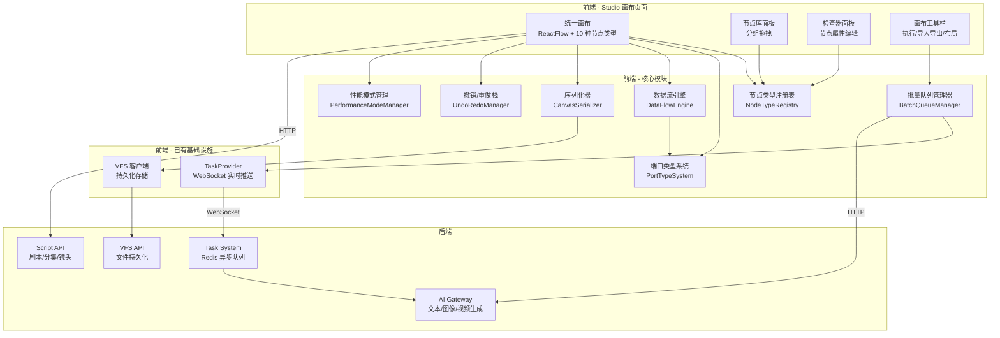
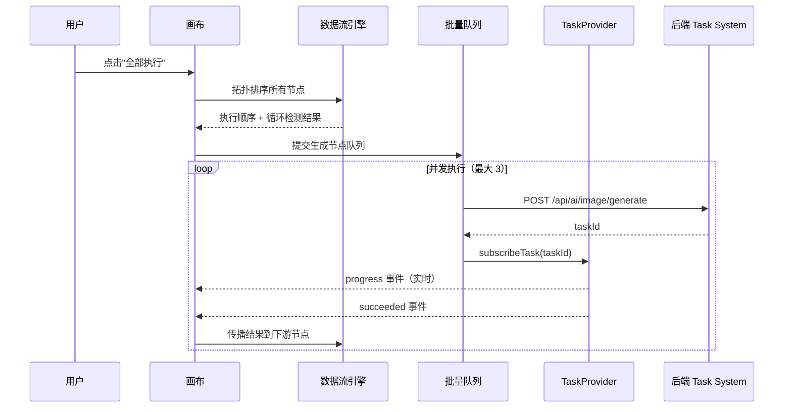
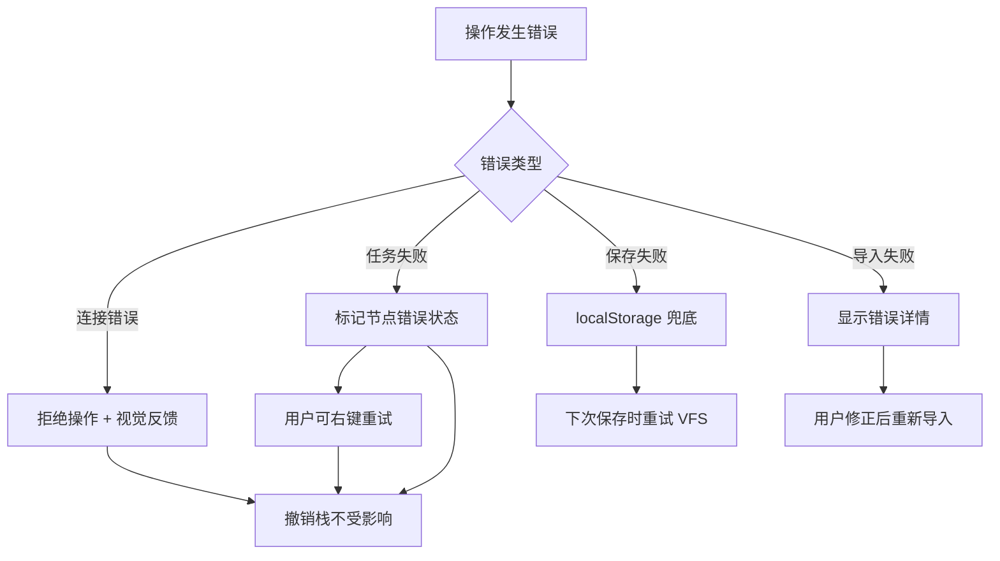

# 设计文档：无限画布 × 分镜融合（Infinite Canvas Storyboard Fusion）

## 概述

本设计将 Studio（创作工坊）画布从一个简单的笔记/媒体画布升级为功能完备的可视化 AI 创作引擎。核心策略是：

1. **合并而非重写**：将分镜页面（`storyboard/page.tsx`）的 6 种节点类型和工作流能力迁移到 Studio 画布（`studio/page.tsx`），形成统一的 10 种节点类型注册表
2. **渐进式增强**：在 Studio 现有的 ReactFlow 画布、VFS 持久化、800ms 防抖自动保存基础上扩展，而非替换
3. **实时化升级**：将分镜页面的顺序 `runWorkflow()` 升级为基于 TaskProvider WebSocket 的并发队列，实现实时进度推送
4. **类型安全连接**：将分镜页面的类型化端口系统（5 种类型）扩展为统一的 5 种数据类型端口协议，增加类型验证和循环检测

### 设计决策与理由

| 决策 | 理由 |
|------|------|
| 基于 Studio 画布扩展，而非基于分镜页面 | Studio 已有完整的 VFS 持久化链路、剧本选择、资产拖拽，分镜页面缺少这些 |
| 不使用 `InfiniteCanvas.tsx` | 该组件是自定义画布实现（非 ReactFlow），与现有两个页面的 ReactFlow 生态不兼容 |
| 节点组件提取为独立文件 | 当前两个页面的节点组件都内联在 page.tsx 中（Studio 约 920 行，分镜约 1030 行），提取后便于复用和测试 |
| 使用 Ajv 做 JSON Schema 验证 | 项目已使用 JSON 序列化，Ajv 是 TypeScript 生态中最成熟的 JSON Schema 验证库 |
| 拓扑排序使用 Kahn 算法 | 同时解决执行顺序和循环检测两个问题，时间复杂度 O(V+E) |

## 架构

### 整体架构图



### 数据流架构




## 组件与接口

### 文件结构

```
nextjs-frontend/
├── lib/canvas/
│   ├── types.ts                    # 统一类型定义（节点、端口、快照）
│   ├── node-registry.ts            # 节点类型注册表
│   ├── port-system.ts              # 端口类型系统与兼容性验证
│   ├── data-flow.ts                # 数据流引擎（拓扑排序、循环检测、传播）
│   ├── batch-queue.ts              # 批量生成队列管理器
│   ├── serializer.ts               # 序列化/反序列化 + JSON Schema 验证
│   ├── undo-redo.ts                # 撤销/重做历史栈
│   ├── performance.ts              # 性能模式管理
│   └── schema.json                 # 工作流快照 JSON Schema
├── components/canvas/
│   ├── nodes/
│   │   ├── TextNoteNode.tsx        # 从 studio/page.tsx 提取
│   │   ├── MediaNode.tsx           # 从 studio/page.tsx 提取
│   │   ├── AssetNode.tsx           # 合并两个页面的 assetNode
│   │   ├── ReferenceNode.tsx       # 从 studio/page.tsx 提取
│   │   ├── ScriptNode.tsx          # 从 storyboard/page.tsx 迁移
│   │   ├── GeneratorNode.tsx       # 从 storyboard/page.tsx 迁移
│   │   ├── PreviewNode.tsx         # 从 storyboard/page.tsx 迁移
│   │   ├── SlicerNode.tsx          # 从 storyboard/page.tsx 迁移
│   │   ├── CandidateNode.tsx       # 从 storyboard/page.tsx 迁移
│   │   ├── StoryboardNode.tsx      # 新建 - 分镜节点
│   │   └── NodeShell.tsx           # 通用节点外壳（从 studio 提取）
│   ├── NodeLibrary.tsx             # 节点库面板（替代 LeftFloatingMenu）
│   ├── CanvasToolbar.tsx           # 画布工具栏（执行/导入导出）
│   ├── TypedEdge.tsx               # 类型化连接线组件
│   └── AlignmentGuides.tsx         # 对齐参考线组件
├── hooks/
│   ├── useDataFlow.ts              # 数据流 hook
│   ├── useBatchQueue.ts            # 批量队列 hook
│   ├── useUndoRedo.ts              # 撤销/重做 hook
│   └── usePerformanceMode.ts       # 性能模式 hook
└── app/(aistudio)/studio/page.tsx  # 升级后的 Studio 画布页面
```

### 核心模块接口

#### 1. 节点类型注册表（NodeTypeRegistry）

```typescript
// lib/canvas/node-registry.ts

import type { ComponentType } from 'react';
import type { NodeProps } from '@xyflow/react';

/** 节点分组 */
type NodeGroup = 'creation' | 'ai-generation' | 'display' | 'reference';

/** 节点类型注册信息 */
interface NodeTypeRegistration {
  type: string;                              // 唯一类型标识
  label: string;                             // 显示名称
  group: NodeGroup;                          // 所属分组
  icon: ComponentType<{ size?: number }>;    // 图标组件
  component: ComponentType<NodeProps<any>>;  // 渲染组件
  defaultData: () => Record<string, unknown>;// 默认数据工厂
  ports: PortDefinition[];                   // 端口定义
}

/** 注册表 API */
function registerNodeType(reg: NodeTypeRegistration): void;
function getNodeType(type: string): NodeTypeRegistration | undefined;
function getNodeTypesByGroup(group: NodeGroup): NodeTypeRegistration[];
function getAllNodeTypes(): Map<string, NodeTypeRegistration>;
function buildReactFlowNodeTypes(): Record<string, ComponentType<NodeProps<any>>>;
```

#### 2. 端口类型系统（PortTypeSystem）

```typescript
// lib/canvas/port-system.ts

/** 端口数据类型 */
type PortDataType = 'text' | 'image' | 'video' | 'asset-ref' | 'storyboard-list';

/** 端口方向 */
type PortDirection = 'input' | 'output';

/** 端口定义 */
interface PortDefinition {
  id: string;                    // 端口 ID（对应 ReactFlow Handle id）
  direction: PortDirection;
  dataType: PortDataType;
  label: string;
  multiple?: boolean;            // 是否允许多条连接（输入端口）
}

/** 端口颜色映射 */
const PORT_COLORS: Record<PortDataType, string> = {
  'text': '#3b82f6',             // 蓝色
  'image': '#a855f7',            // 紫色
  'video': '#22c55e',            // 绿色
  'asset-ref': '#f97316',        // 橙色
  'storyboard-list': '#06b6d4',  // 青色
};

/** 类型兼容性检查 */
function arePortsCompatible(source: PortDefinition, target: PortDefinition): boolean;

/** 连接验证（含循环检测） */
function validateConnection(
  connection: { source: string; sourceHandle: string; target: string; targetHandle: string },
  nodes: Node[],
  edges: Edge[],
  registry: Map<string, NodeTypeRegistration>
): { valid: boolean; reason?: string };
```

#### 3. 数据流引擎（DataFlowEngine）

```typescript
// lib/canvas/data-flow.ts

/** 拓扑排序结果 */
interface TopologySortResult {
  order: string[];               // 节点 ID 的执行顺序
  hasCycle: boolean;             // 是否存在循环
  cycleNodes?: string[];         // 参与循环的节点 ID
}

/** Kahn 算法拓扑排序 + 循环检测 */
function topologySort(nodes: Node[], edges: Edge[]): TopologySortResult;

/** 检测添加一条边是否会产生循环 */
function wouldCreateCycle(
  edges: Edge[],
  newEdge: { source: string; target: string }
): boolean;

/** 获取节点的所有下游节点（BFS） */
function getDownstreamNodes(nodeId: string, edges: Edge[]): string[];

/** 沿连接传播数据到下游节点 */
function propagateData(
  sourceNodeId: string,
  outputPortId: string,
  data: unknown,
  nodes: Node[],
  edges: Edge[],
  setNodes: (updater: (nodes: Node[]) => Node[]) => void
): void;
```

#### 4. 批量队列管理器（BatchQueueManager）

```typescript
// lib/canvas/batch-queue.ts

type QueueItemStatus = 'pending' | 'running' | 'succeeded' | 'failed' | 'canceled' | 'timeout';

interface QueueItem {
  nodeId: string;
  taskId?: string;               // 后端 Task ID（提交后填充）
  status: QueueItemStatus;
  progress: number;              // 0-100
  error?: string;
  startedAt?: number;
}

interface BatchQueueState {
  items: QueueItem[];
  maxConcurrency: number;        // 默认 3
  isRunning: boolean;
  completedCount: number;
  totalCount: number;
}

interface BatchQueueManager {
  /** 提交节点到队列（按拓扑排序） */
  enqueue(nodeIds: string[], nodes: Node[], edges: Edge[]): void;
  
  /** 开始执行队列 */
  start(): void;
  
  /** 停止全部（取消排队 + 发送取消请求） */
  stopAll(): void;
  
  /** 取消单个任务 */
  cancelTask(nodeId: string): void;
  
  /** 获取队列状态 */
  getState(): BatchQueueState;
  
  /** 超时检查（300 秒） */
  checkTimeouts(): void;
}
```

#### 5. 序列化器（CanvasSerializer）

```typescript
// lib/canvas/serializer.ts

/** 工作流快照格式（扩展现有 serializeCanvas 输出） */
interface WorkflowSnapshot {
  version: number;                // 递增版本号
  canvasId: string;
  reactflow: {
    nodes: SerializedNode[];
    edges: SerializedEdge[];
    viewport: { x: number; y: number; zoom: number };
  };
  updatedAt: string;              // ISO 8601
}

interface SerializedNode {
  id: string;
  type: string;
  position: { x: number; y: number };
  data: Record<string, unknown>;  // 节点完整数据（含生成结果 URL、进度等）
  collapsed?: boolean;            // 新增：折叠状态
}

interface SerializedEdge {
  id: string;
  source: string;
  target: string;
  sourceHandle?: string;
  targetHandle?: string;
  data?: {
    portType?: PortDataType;      // 新增：端口类型信息
  };
}

/** 序列化 */
function serializeCanvas(
  canvasId: string,
  nodes: Node[],
  edges: Edge[],
  viewport: { x: number; y: number; zoom: number }
): WorkflowSnapshot;

/** 反序列化（含 JSON Schema 验证） */
function deserializeCanvas(
  json: string
): { success: true; snapshot: WorkflowSnapshot } | { success: false; errors: string[] };

/** 版本迁移 */
function migrateSnapshot(snapshot: WorkflowSnapshot): WorkflowSnapshot;

/** 导出为 JSON 文件 */
function exportToFile(snapshot: WorkflowSnapshot, filename?: string): void;

/** 导出选中节点 */
function exportSelectedNodes(
  selectedNodeIds: string[],
  nodes: Node[],
  edges: Edge[],
  canvasId: string
): WorkflowSnapshot;

/** 从 JSON 文件导入 */
function importFromFile(
  file: File
): Promise<{ success: true; snapshot: WorkflowSnapshot } | { success: false; errors: string[] }>;
```

#### 6. 撤销/重做管理器

```typescript
// lib/canvas/undo-redo.ts

interface CanvasState {
  nodes: Node[];
  edges: Edge[];
}

interface UndoRedoManager {
  /** 记录一个操作（自动裁剪到 50 步） */
  push(state: CanvasState): void;
  
  /** 撤销 */
  undo(): CanvasState | null;
  
  /** 重做 */
  redo(): CanvasState | null;
  
  /** 是否可撤销/重做 */
  canUndo: boolean;
  canRedo: boolean;
}
```

#### 7. 性能模式管理

```typescript
// lib/canvas/performance.ts

type PerformanceMode = 'high-quality' | 'normal' | 'fast';

interface PerformanceModeManager {
  mode: PerformanceMode;
  setMode(mode: PerformanceMode): void;
  
  /** 根据节点数量自动建议模式 */
  suggestMode(nodeCount: number): PerformanceMode | null;
  
  /** 判断节点是否在视口内 */
  isInViewport(nodePosition: { x: number; y: number }, viewport: Viewport): boolean;
  
  /** 获取节点渲染级别 */
  getNodeRenderLevel(
    nodePosition: { x: number; y: number },
    viewport: Viewport,
    mode: PerformanceMode
  ): 'full' | 'simplified' | 'placeholder';
}
```


## 数据模型

### 统一节点数据类型

```typescript
// lib/canvas/types.ts

/** ===== 端口类型 ===== */

type PortDataType = 'text' | 'image' | 'video' | 'asset-ref' | 'storyboard-list';

type PortDirection = 'input' | 'output';

interface PortDefinition {
  id: string;
  direction: PortDirection;
  dataType: PortDataType;
  label: string;
  multiple?: boolean;
}

/** ===== 节点基础类型 ===== */

/** 所有节点共享的基础字段 */
interface BaseNodeData {
  label?: string;
  collapsed?: boolean;
}

/** 文本笔记节点 - 来自 Studio TextNoteNodeData */
interface TextNoteNodeData extends BaseNodeData {
  kind: 'text-note';
  title: string;
  content: string;
}

/** 媒体节点 - 来自 Studio MediaNodeData */
interface MediaNodeData extends BaseNodeData {
  kind: 'media';
  title: string;
  mediaType: 'image' | 'video';
  resultUrl?: string;
}

/** 资产节点 - 合并 Studio AssetNodeData + Storyboard AssetNode */
interface AssetNodeData extends BaseNodeData {
  kind: 'asset';
  assetId: string;
  name: string;
  assetType: string;
  thumbnail?: string;
  category?: string;
}

/** 引用节点 - 来自 Studio ReferenceNodeData */
interface ReferenceNodeData extends BaseNodeData {
  kind: 'reference';
  title: string;
  description?: string;
  dialogue?: string;
  sourceInfo?: {
    scriptId?: string;
    episodeId?: string;
    shotCode?: string;
  };
}

/** 剧本节点 - 来自 Storyboard ScriptNode */
interface ScriptNodeData extends BaseNodeData {
  kind: 'script';
  text: string;                    // 剧本文本，最大 10000 字符
}

/** 生成节点 - 来自 Storyboard GeneratorNode */
interface GeneratorNodeData extends BaseNodeData {
  kind: 'generator';
  model: string;                   // AI 模型标识
  prompt: string;
  negPrompt?: string;
  aspectRatio?: string;
  isExtraction?: boolean;          // 是否为提取模式
  isProcessing?: boolean;
  progress?: number;               // 0-100
  taskId?: string;                 // 后端任务 ID
  lastImage?: string;              // 生成结果 URL
  error?: string;
}

/** 预览节点 - 来自 Storyboard PreviewNode */
interface PreviewNodeData extends BaseNodeData {
  kind: 'preview';
  mediaType?: 'image' | 'video';
  url?: string;                    // 预览内容 URL
}

/** 拆分节点 - 来自 Storyboard SlicerNode */
interface SlicerNodeData extends BaseNodeData {
  kind: 'slicer';
  isProcessing?: boolean;
  storyboardItems?: StoryboardItem[];  // 拆分结果
}

/** 提取节点 - 来自 Storyboard CandidateNode */
interface CandidateNodeData extends BaseNodeData {
  kind: 'candidate';
  isProcessing?: boolean;
  candidates?: AssetCandidate[];
}

/** 分镜节点 - 新建 */
interface StoryboardNodeData extends BaseNodeData {
  kind: 'storyboard';
  shotNumber: number;              // 镜头编号
  sceneDescription: string;        // 场景描述
  dialogue?: string;               // 对白文本
  referenceImageUrl?: string;      // 画面参考缩略图
  sourceStoryboardId?: string;     // 关联后端 Storyboard 记录 ID
}

/** 分镜条目（拆分节点输出） */
interface StoryboardItem {
  shotNumber: number;
  sceneDescription: string;
  dialogue?: string;
}

/** 资产候选（提取节点输出） */
interface AssetCandidate {
  name: string;
  description?: string;
  tags?: string[];
}

/** 所有节点数据的联合类型 */
type UnifiedNodeData =
  | TextNoteNodeData
  | MediaNodeData
  | AssetNodeData
  | ReferenceNodeData
  | ScriptNodeData
  | GeneratorNodeData
  | PreviewNodeData
  | SlicerNodeData
  | CandidateNodeData
  | StoryboardNodeData;

/** 节点类型标识 */
type UnifiedNodeType =
  | 'textNoteNode'
  | 'mediaNode'
  | 'assetNode'
  | 'referenceNode'
  | 'scriptNode'
  | 'generatorNode'
  | 'previewNode'
  | 'slicerNode'
  | 'candidateNode'
  | 'storyboardNode';
```

### 工作流快照 JSON Schema

```json
{
  "$schema": "http://json-schema.org/draft-07/schema#",
  "type": "object",
  "required": ["version", "canvasId", "reactflow", "updatedAt"],
  "properties": {
    "version": { "type": "integer", "minimum": 1 },
    "canvasId": { "type": "string", "minLength": 1 },
    "reactflow": {
      "type": "object",
      "required": ["nodes", "edges", "viewport"],
      "properties": {
        "nodes": {
          "type": "array",
          "items": {
            "type": "object",
            "required": ["id", "type", "position", "data"],
            "properties": {
              "id": { "type": "string" },
              "type": { 
                "type": "string",
                "enum": [
                  "textNoteNode", "mediaNode", "assetNode", "referenceNode",
                  "scriptNode", "generatorNode", "previewNode",
                  "slicerNode", "candidateNode", "storyboardNode"
                ]
              },
              "position": {
                "type": "object",
                "required": ["x", "y"],
                "properties": {
                  "x": { "type": "number" },
                  "y": { "type": "number" }
                }
              },
              "data": { "type": "object" },
              "collapsed": { "type": "boolean" }
            }
          }
        },
        "edges": {
          "type": "array",
          "items": {
            "type": "object",
            "required": ["id", "source", "target"],
            "properties": {
              "id": { "type": "string" },
              "source": { "type": "string" },
              "target": { "type": "string" },
              "sourceHandle": { "type": "string" },
              "targetHandle": { "type": "string" },
              "data": {
                "type": "object",
                "properties": {
                  "portType": {
                    "type": "string",
                    "enum": ["text", "image", "video", "asset-ref", "storyboard-list"]
                  }
                }
              }
            }
          }
        },
        "viewport": {
          "type": "object",
          "required": ["x", "y", "zoom"],
          "properties": {
            "x": { "type": "number" },
            "y": { "type": "number" },
            "zoom": { "type": "number", "exclusiveMinimum": 0 }
          }
        }
      }
    },
    "updatedAt": { "type": "string", "format": "date-time" }
  }
}
```

### 端口类型兼容性矩阵

| 源端口类型 → 目标端口类型 | text | image | video | asset-ref | storyboard-list |
|---------------------------|------|-------|-------|-----------|-----------------|
| text                      | ✅   | ❌    | ❌    | ❌        | ❌              |
| image                     | ❌   | ✅    | ❌    | ❌        | ❌              |
| video                     | ❌   | ❌    | ✅    | ❌        | ❌              |
| asset-ref                 | ❌   | ❌    | ❌    | ✅        | ❌              |
| storyboard-list           | ❌   | ❌    | ❌    | ❌        | ✅              |

> 端口类型严格匹配，不支持隐式转换。这简化了类型系统并避免了数据丢失。

### 节点端口定义表

| 节点类型 | 输入端口 | 输出端口 |
|----------|----------|----------|
| textNoteNode | — | — |
| mediaNode | — | image 或 video |
| assetNode | — | asset-ref |
| referenceNode | — | — |
| scriptNode | — | text |
| generatorNode | text (in-script), asset-ref (in-ref) | image |
| previewNode | image (in-image) | image (out-image) |
| slicerNode | text (in-text) | storyboard-list |
| candidateNode | text (in-data) | — |
| storyboardNode | image (in-image), asset-ref (in-asset) | text (out-desc) |

### 关键算法

#### Kahn 算法拓扑排序（含循环检测）

```typescript
function topologySort(nodes: Node[], edges: Edge[]): TopologySortResult {
  const nodeIds = new Set(nodes.map(n => n.id));
  const inDegree = new Map<string, number>();
  const adjacency = new Map<string, string[]>();
  
  // 初始化
  for (const id of nodeIds) {
    inDegree.set(id, 0);
    adjacency.set(id, []);
  }
  
  // 构建邻接表和入度
  for (const edge of edges) {
    if (nodeIds.has(edge.source) && nodeIds.has(edge.target)) {
      adjacency.get(edge.source)!.push(edge.target);
      inDegree.set(edge.target, (inDegree.get(edge.target) || 0) + 1);
    }
  }
  
  // BFS：从入度为 0 的节点开始
  const queue: string[] = [];
  for (const [id, deg] of inDegree) {
    if (deg === 0) queue.push(id);
  }
  
  const order: string[] = [];
  while (queue.length > 0) {
    const current = queue.shift()!;
    order.push(current);
    for (const neighbor of adjacency.get(current) || []) {
      const newDeg = (inDegree.get(neighbor) || 1) - 1;
      inDegree.set(neighbor, newDeg);
      if (newDeg === 0) queue.push(neighbor);
    }
  }
  
  // 如果排序结果不包含所有节点，说明存在循环
  const hasCycle = order.length < nodeIds.size;
  const cycleNodes = hasCycle
    ? [...nodeIds].filter(id => !order.includes(id))
    : undefined;
  
  return { order, hasCycle, cycleNodes };
}
```

#### 循环检测（单条边添加时）

```typescript
function wouldCreateCycle(
  edges: Edge[],
  newEdge: { source: string; target: string }
): boolean {
  // 从 newEdge.target 出发 BFS，看能否到达 newEdge.source
  const visited = new Set<string>();
  const queue = [newEdge.target];
  
  while (queue.length > 0) {
    const current = queue.shift()!;
    if (current === newEdge.source) return true;
    if (visited.has(current)) continue;
    visited.add(current);
    
    for (const edge of edges) {
      if (edge.source === current) {
        queue.push(edge.target);
      }
    }
  }
  
  return false;
}
```


## 正确性属性（Correctness Properties）

*属性（Property）是指在系统所有合法执行中都应成立的特征或行为——本质上是对系统应做什么的形式化陈述。属性是人类可读规格说明与机器可验证正确性保证之间的桥梁。*

以下属性基于对所有 7 个需求模块共 60+ 条验收标准的逐条分析，经过冗余消除和合并后得出。每个属性都是可通过属性基测试（Property-Based Testing）自动验证的通用量化陈述。

### Property 1: 节点注册表分组完整性

*For any* 节点类型注册信息，该节点类型必须恰好属于四个分组之一（创作组、AI 生成组、展示组、引用组），且每个分组包含的节点类型集合与预定义的分组映射一致。

**Validates: Requirements 1.2**

### Property 2: 节点创建正确性

*For any* 合法的节点类型标识和画布坐标位置，通过节点工厂创建的节点实例应具有正确的 `type` 字段、与输入一致的 `position`、以及该节点类型注册信息中定义的默认数据结构。

**Validates: Requirements 1.3, 4.2**

### Property 3: 剧本节点文本长度约束

*For any* 字符串，当其长度不超过 10000 个字符时，剧本节点应接受该文本作为输入；当其长度超过 10000 个字符时，剧本节点应拒绝该输入。

**Validates: Requirements 1.4**

### Property 4: 节点折叠状态切换

*For any* 节点数据中的 `collapsed` 布尔值，执行一次折叠切换操作后 `collapsed` 应变为相反值；执行两次切换后应恢复原始值（幂等性）。对于批量操作，*for any* 选中的节点集合，批量折叠应将所有选中节点的 `collapsed` 设为相同的目标值。

**Validates: Requirements 1.13, 5.5**

### Property 5: 端口类型兼容性验证

*For any* 两个端口定义（一个输出端口和一个输入端口），`validateConnection` 应返回 `valid: true` 当且仅当两个端口的 `dataType` 相同。对于同一输出端口连接到多个输入端口的情况，只要类型匹配，所有连接都应被允许。

**Validates: Requirements 2.2, 2.3, 2.5, 4.6**

### Property 6: 数据沿 DAG 传播完整性

*For any* 由节点和边组成的有向无环图（DAG），当一个源节点的输出数据发生变化时，所有通过边可达的下游节点都应接收到更新后的数据，且不可达的节点不应被影响。

**Validates: Requirements 2.4**

### Property 7: 循环连接检测

*For any* 由节点和边组成的有向无环图（DAG），`wouldCreateCycle` 对于任何会形成环的新边应返回 `true`，对于不会形成环的新边应返回 `false`。等价地，添加新边后对图执行拓扑排序，当且仅当 `wouldCreateCycle` 返回 `true` 时拓扑排序应报告存在循环。

**Validates: Requirements 2.6**

### Property 8: 端口颜色映射唯一性

*For any* 两个不同的端口数据类型，它们在 `PORT_COLORS` 映射中对应的颜色值应不相同。

**Validates: Requirements 2.9**

### Property 9: 拓扑排序有效性

*For any* 由节点和边组成的有向无环图（DAG），`topologySort` 返回的执行顺序应满足：对于图中的每条边 `(u, v)`，`u` 在排序结果中的位置应在 `v` 之前。且排序结果应包含图中的所有节点。

**Validates: Requirements 3.1**

### Property 10: 并发限制执行

*For any* 包含 N 个任务的执行队列和并发限制 C，在队列执行的任意时刻，处于 `running` 状态的任务数量不应超过 C。

**Validates: Requirements 3.2**

### Property 11: 任务事件驱动节点状态更新

*For any* 任务事件（progress/succeeded/failed），生成节点的状态应按以下规则更新：`progress` 事件更新进度百分比，`succeeded` 事件设置结果 URL 并清除处理中标志，`failed` 事件设置错误信息并清除处理中标志。

**Validates: Requirements 3.4, 3.5, 3.6**

### Property 12: 停止全部取消排队任务

*For any* 包含若干 `pending` 状态任务的批量队列，调用 `stopAll` 后所有 `pending` 状态的任务应变为 `canceled` 状态，已完成（`succeeded`/`failed`）的任务状态不应改变。

**Validates: Requirements 3.8**

### Property 13: 超时检测

*For any* 处于 `running` 状态且已运行超过 300 秒的队列任务，`checkTimeouts` 应将其标记为 `timeout` 状态。运行时间未超过 300 秒的任务不应被标记。

**Validates: Requirements 3.9**

### Property 14: 选中节点过滤执行

*For any* 画布上的节点集合和用户选中的生成节点子集，`enqueue` 应仅将选中的生成节点加入执行队列，非生成节点和未选中的生成节点不应出现在队列中。

**Validates: Requirements 3.10**

### Property 15: 分镜列表自动创建节点数量

*For any* 包含 N 个分镜条目的列表（N ≥ 0），自动创建操作应恰好产生 N 个分镜节点，每个节点的 `shotNumber`、`sceneDescription` 和 `dialogue` 应与对应的列表条目一致。

**Validates: Requirements 4.3**

### Property 16: 性能模式渲染级别

*For any* 节点位置、视口状态和性能模式组合，`getNodeRenderLevel` 应返回正确的渲染级别：高质量模式下所有节点返回 `full`；普通模式下视口内节点返回 `full`、视口外返回 `simplified`；极速模式下视口内返回 `full`、视口外返回 `placeholder`。当缩放级别低于 0.3 时，所有模式下视口外节点均返回 `placeholder`。`suggestMode` 在节点数量超过 50 时应返回 `normal`。

**Validates: Requirements 5.1, 5.2, 5.8**

### Property 17: 撤销/重做往返与栈限制

*For any* 画布状态序列，执行 `push` 后 `undo` 应恢复到前一个状态，再执行 `redo` 应恢复到 `undo` 之前的状态（往返一致性）。*For any* 超过 50 次的 `push` 操作序列，历史栈中的条目数量不应超过 50。

**Validates: Requirements 5.7**

### Property 18: 选中节点导出

*For any* 画布上的节点和边集合以及选中的节点子集，`exportSelectedNodes` 导出的快照应仅包含选中的节点，且仅包含源节点和目标节点都在选中集合中的边。

**Validates: Requirements 6.6**

### Property 19: 版本迁移数据保持

*For any* 旧版本的工作流快照，`migrateSnapshot` 应产生一个版本号为当前版本的快照，且原始快照中的所有节点和边数据应在迁移后的快照中保留。

**Validates: Requirements 6.9**

### Property 20: 序列化往返一致性

*For any* 合法的工作流快照（包含任意组合的 10 种节点类型、任意连接和视口状态），执行 `serialize → JSON.stringify → JSON.parse → deserialize` 应产生与原始快照等价的工作流状态。节点的所有数据字段（文本内容、模型配置、生成结果 URL、进度状态、折叠状态）均应在往返后保持不变。

**Validates: Requirements 7.1, 7.2, 7.3, 7.6**

### Property 21: 序列化输出符合 Schema

*For any* 合法的画布状态（任意节点、边、视口组合），`serializeCanvas` 的输出应通过 JSON Schema 验证。

**Validates: Requirements 7.4, 6.7**

### Property 22: 非法输入被 Schema 拒绝

*For any* 不符合 JSON Schema 的 JSON 字符串（缺少必需字段、字段类型错误、节点类型不在枚举范围内等），`deserializeCanvas` 应返回 `{ success: false, errors: [...] }`，且 `errors` 数组非空并包含描述性错误信息。

**Validates: Requirements 7.5, 6.8**


## 错误处理

### 分层错误处理策略

| 层级 | 错误类型 | 处理方式 |
|------|----------|----------|
| 端口连接 | 类型不兼容 | `validateConnection` 返回 `{ valid: false, reason }` → 端口变红 + toast 提示 |
| 端口连接 | 循环检测 | `wouldCreateCycle` 返回 `true` → 拒绝连接 + toast "不允许循环连接" |
| 批量队列 | 单任务失败 | 节点显示错误标识 → 队列继续执行其他任务 → 用户可右键重试 |
| 批量队列 | 任务超时（300s） | 标记为 `timeout` → 自动跳过 → 继续队列 |
| 批量队列 | WebSocket 断连 | TaskProvider 自动重连（1s 延迟）→ 重连后重新订阅活跃任务 |
| 持久化 | VFS 保存失败 | 降级到 localStorage → 显示 "保存失败（已本地兜底）" |
| 持久化 | localStorage 也满 | 显示错误 toast → 建议用户导出工作流 JSON 文件 |
| 导入 | JSON 格式不合法 | `deserializeCanvas` 返回错误列表 → 显示具体错误信息 |
| 导入 | 版本不兼容 | 尝试 `migrateSnapshot` → 迁移失败则显示 "版本不兼容" 错误 |
| 序列化 | 节点数据不完整 | 序列化时使用默认值填充缺失字段 → 反序列化时验证并警告 |
| 性能 | 节点数量过多 | `suggestMode` 建议切换性能模式 → 用户确认后切换 |

### 错误恢复机制



## 测试策略

### 双轨测试方法

本特性采用单元测试 + 属性基测试的双轨策略：

- **单元测试**：验证具体示例、边界条件和错误场景
- **属性基测试**：验证跨所有输入的通用属性

两者互补：单元测试捕获具体 bug，属性基测试验证通用正确性。

### 属性基测试配置

- **测试库**：[fast-check](https://github.com/dubzzz/fast-check)（TypeScript 生态最成熟的 PBT 库，项目已使用 TypeScript + Jest/Vitest）
- **每个属性测试最少运行 100 次迭代**
- **每个属性测试必须用注释引用设计文档中的属性编号**
- **标签格式**：`Feature: infinite-canvas-storyboard-fusion, Property {number}: {property_text}`
- **每个正确性属性由一个属性基测试实现**

### 测试文件结构

```
nextjs-frontend/__tests__/canvas/
├── node-registry.test.ts          # 单元测试：节点注册表
├── node-registry.pbt.test.ts      # 属性测试：P1, P2, P3, P4
├── port-system.test.ts            # 单元测试：端口类型系统
├── port-system.pbt.test.ts        # 属性测试：P5, P8
├── data-flow.test.ts              # 单元测试：数据流引擎
├── data-flow.pbt.test.ts          # 属性测试：P6, P7, P9
├── batch-queue.test.ts            # 单元测试：批量队列
├── batch-queue.pbt.test.ts        # 属性测试：P10, P11, P12, P13, P14
├── serializer.test.ts             # 单元测试：序列化器
├── serializer.pbt.test.ts         # 属性测试：P20, P21, P22
├── undo-redo.test.ts              # 单元测试：撤销/重做
├── undo-redo.pbt.test.ts          # 属性测试：P17
├── performance.test.ts            # 单元测试：性能模式
├── performance.pbt.test.ts        # 属性测试：P16
├── storyboard-fusion.test.ts      # 单元测试：分镜融合
├── storyboard-fusion.pbt.test.ts  # 属性测试：P15
└── export-import.pbt.test.ts      # 属性测试：P18, P19
```

### 生成器设计（fast-check Arbitraries）

属性基测试需要以下自定义生成器：

```typescript
import * as fc from 'fast-check';

/** 生成随机端口数据类型 */
const arbPortDataType = fc.constantFrom('text', 'image', 'video', 'asset-ref', 'storyboard-list');

/** 生成随机节点类型 */
const arbNodeType = fc.constantFrom(
  'textNoteNode', 'mediaNode', 'assetNode', 'referenceNode',
  'scriptNode', 'generatorNode', 'previewNode',
  'slicerNode', 'candidateNode', 'storyboardNode'
);

/** 生成随机画布坐标 */
const arbPosition = fc.record({
  x: fc.double({ min: -10000, max: 10000, noNaN: true }),
  y: fc.double({ min: -10000, max: 10000, noNaN: true }),
});

/** 生成随机视口 */
const arbViewport = fc.record({
  x: fc.double({ min: -5000, max: 5000, noNaN: true }),
  y: fc.double({ min: -5000, max: 5000, noNaN: true }),
  zoom: fc.double({ min: 0.01, max: 10, noNaN: true }),
});

/** 生成随机 DAG（有向无环图） */
const arbDAG = fc.integer({ min: 2, max: 20 }).chain(nodeCount => {
  const nodeIds = Array.from({ length: nodeCount }, (_, i) => `node-${i}`);
  // 只生成 i < j 的边以保证无环
  const possibleEdges: Array<{ source: string; target: string }> = [];
  for (let i = 0; i < nodeCount; i++) {
    for (let j = i + 1; j < nodeCount; j++) {
      possibleEdges.push({ source: nodeIds[i], target: nodeIds[j] });
    }
  }
  return fc.subarray(possibleEdges).map(edges => ({
    nodes: nodeIds.map(id => ({ id, type: 'generatorNode', position: { x: 0, y: 0 }, data: {} })),
    edges: edges.map((e, idx) => ({ id: `edge-${idx}`, ...e })),
  }));
});

/** 生成随机工作流快照 */
const arbWorkflowSnapshot = fc.record({
  version: fc.constant(1),
  canvasId: fc.string({ minLength: 1, maxLength: 50 }),
  reactflow: fc.record({
    nodes: fc.array(fc.record({
      id: fc.uuid(),
      type: arbNodeType,
      position: arbPosition,
      data: fc.record({ label: fc.option(fc.string(), { nil: undefined }) }),
      collapsed: fc.option(fc.boolean(), { nil: undefined }),
    }), { minLength: 0, maxLength: 10 }),
    edges: fc.constant([]),  // 边在节点生成后根据节点 ID 生成
    viewport: arbViewport,
  }),
  updatedAt: fc.date().map(d => d.toISOString()),
});
```

### 单元测试重点

单元测试聚焦于以下场景（避免与属性测试重复）：

1. **节点注册表**：验证 10 种节点类型全部注册、`buildReactFlowNodeTypes` 返回正确映射
2. **端口系统**：验证具体节点对的连接（如 scriptNode.text → generatorNode.in-script）
3. **数据流**：空图、单节点、线性链的拓扑排序
4. **批量队列**：空队列执行、单任务执行、全部失败场景
5. **序列化**：Studio v1 格式向新格式的迁移、空画布序列化
6. **撤销/重做**：空栈 undo/redo 返回 null、恰好 50 步边界
7. **性能模式**：恰好 50 个节点的建议阈值、zoom = 0.3 的边界
8. **集成测试**：节点库拖拽 → 创建节点 → 连接 → 执行 → 预览的端到端流程（使用 mock TaskProvider）

### 属性测试与需求追溯

| 属性 | 测试文件 | 验证的需求 |
|------|----------|------------|
| P1 | node-registry.pbt.test.ts | 1.2 |
| P2 | node-registry.pbt.test.ts | 1.3, 4.2 |
| P3 | node-registry.pbt.test.ts | 1.4 |
| P4 | node-registry.pbt.test.ts | 1.13, 5.5 |
| P5 | port-system.pbt.test.ts | 2.2, 2.3, 2.5, 4.6 |
| P6 | data-flow.pbt.test.ts | 2.4 |
| P7 | data-flow.pbt.test.ts | 2.6 |
| P8 | port-system.pbt.test.ts | 2.9 |
| P9 | data-flow.pbt.test.ts | 3.1 |
| P10 | batch-queue.pbt.test.ts | 3.2 |
| P11 | batch-queue.pbt.test.ts | 3.4, 3.5, 3.6 |
| P12 | batch-queue.pbt.test.ts | 3.8 |
| P13 | batch-queue.pbt.test.ts | 3.9 |
| P14 | batch-queue.pbt.test.ts | 3.10 |
| P15 | storyboard-fusion.pbt.test.ts | 4.3 |
| P16 | performance.pbt.test.ts | 5.1, 5.2, 5.8 |
| P17 | undo-redo.pbt.test.ts | 5.7 |
| P18 | export-import.pbt.test.ts | 6.6 |
| P19 | export-import.pbt.test.ts | 6.9 |
| P20 | serializer.pbt.test.ts | 7.1, 7.2, 7.3, 7.6 |
| P21 | serializer.pbt.test.ts | 7.4, 6.7 |
| P22 | serializer.pbt.test.ts | 7.5, 6.8 |
