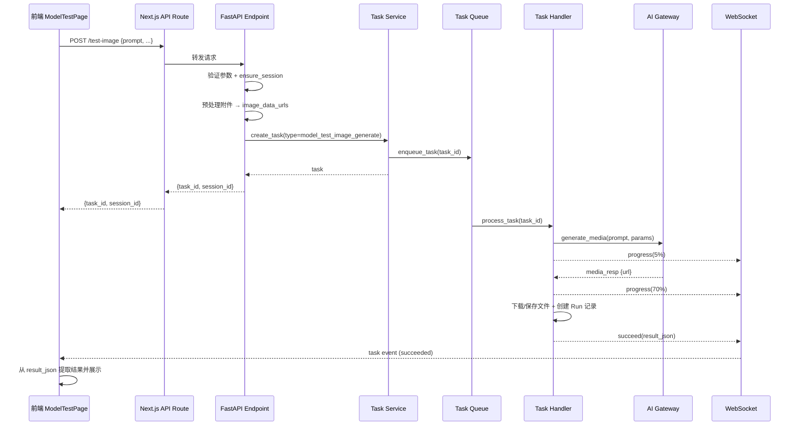
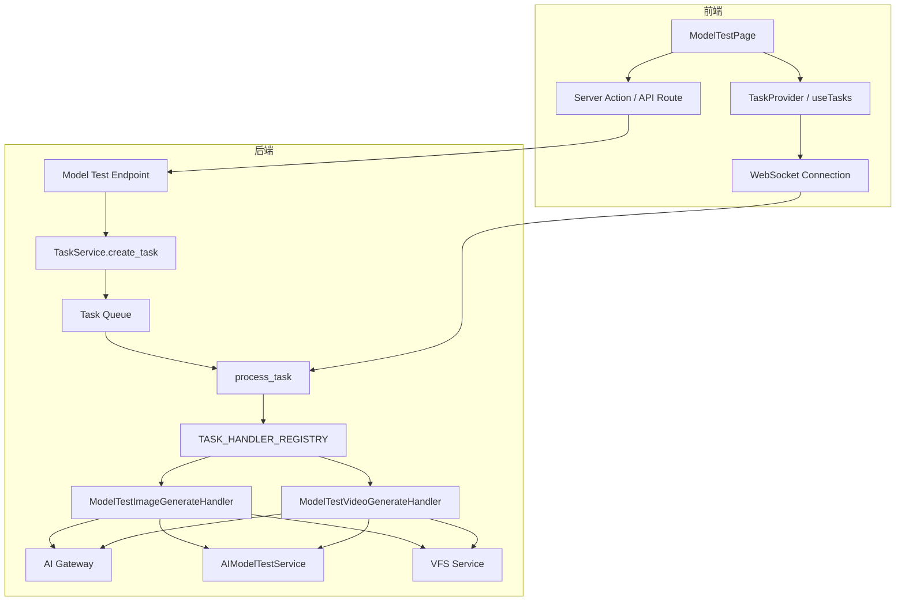

# 设计文档：模型测试异步任务化

## 概述

将模型测试页面的图片/视频生成从同步 HTTP 请求模式重构为异步任务模式。核心变更：

1. **后端**：新增两个 Task Handler（`model_test_image_generate` / `model_test_video_generate`），端点从同步阻塞改为立即返回 `task_id`
2. **前端**：提交后通过 `TaskProvider` 的 WebSocket 机制监听任务状态，展示进度和结果
3. **API 路由层**：移除长超时配置，恢复默认超时

### 设计决策

- **复用现有 Task System**：项目已有完整的异步任务基础设施（`BaseTaskHandler` → `TASK_HANDLER_REGISTRY` → `process_task` → `TaskReporter` → WebSocket 推送），无需引入新机制
- **新建独立 Handler 而非复用 `asset_image_generate`**：模型测试 Handler 不需要 `project_id`/`parent_node_id` 等资产管理参数，职责更简单（生成 + 保存 Run 记录），独立 Handler 更清晰
- **附件预处理保留在端点层**：读取 `file_node` 并转换为 `data_url` 的逻辑在端点中执行（同步、快速），将处理后的 `image_data_urls` 存入 `input_json`，避免 Handler 中处理权限校验

## 架构

### 整体流程



### 组件关系



## 组件与接口

### 1. ModelTestImageGenerateHandler

**文件**: `fastapi_backend/app/tasks/handlers/model_test_image_generate.py`

```python
class ModelTestImageGenerateHandler(BaseTaskHandler):
    task_type = "model_test_image_generate"

    async def run(self, *, db: AsyncSession, task: Task, reporter: TaskReporter) -> dict[str, Any]:
        # input_json 字段:
        #   prompt: str
        #   resolution: str | None
        #   model_config_id: str (UUID)
        #   session_id: str (UUID)
        #   image_data_urls: list[str] | None  (预处理后的 data URL)
        #   input_file_node_ids: list[str] | None
        #
        # 返回 result_json:
        #   url: str
        #   output_file_node_id: str | None
        #   output_content_type: str | None
        #   session_id: str
        #   run_id: str
```

**处理流程**:
1. 从 `input_json` 解析参数
2. `reporter.progress(progress=5)` — 开始
3. 调用 `ai_gateway_service.generate_media(category="image")`
4. `reporter.progress(progress=70)` — AI 调用完成
5. 下载/解析生成结果，通过 `vfs_service` 保存文件
6. `reporter.progress(progress=90)` — 文件保存完成
7. 通过 `ai_model_test_service.add_image_run()` 创建 Run 记录
8. 返回 `result_json`

**错误处理**: 异常由 `process_task` 捕获并调用 `reporter.fail()`。Handler 在 `except` 块中额外创建包含 `error_message` 的 ImageRun 记录。

### 2. ModelTestVideoGenerateHandler

**文件**: `fastapi_backend/app/tasks/handlers/model_test_video_generate.py`

```python
class ModelTestVideoGenerateHandler(BaseTaskHandler):
    task_type = "model_test_video_generate"

    async def run(self, *, db: AsyncSession, task: Task, reporter: TaskReporter) -> dict[str, Any]:
        # input_json 字段:
        #   prompt: str
        #   duration: int | None
        #   aspect_ratio: str | None
        #   model_config_id: str (UUID)
        #   session_id: str (UUID)
        #   image_data_urls: list[str] | None
        #   input_file_node_ids: list[str] | None
        #
        # 返回 result_json:
        #   url: str
        #   output_file_node_id: str | None
        #   output_content_type: str | None
        #   session_id: str
        #   run_id: str
```

**处理流程**:
1. 从 `input_json` 解析参数
2. `reporter.progress(progress=5)` — 开始
3. 调用 `ai_gateway_service.generate_media(category="video")`
4. `reporter.progress(progress=50)` — AI 调用完成
5. 下载/解析生成结果，通过 `vfs_service` 保存文件
6. `reporter.progress(progress=85)` — 文件保存完成
7. 通过 `ai_model_test_service.add_video_run()` 创建 Run 记录
8. 返回 `result_json`

**进度节点**（比图片多一个，因为视频生成通常更耗时）:
- 5%: 任务开始，参数解析完成
- 50%: AI 供应商调用完成（含轮询等待）
- 85%: 视频文件下载/保存完成

### 3. 重构后的端点接口

**POST `/api/v1/ai/admin/model-configs/{id}/test-image`**

请求体不变，响应改为：
```json
{
  "code": 200,
  "msg": "OK",
  "data": {
    "task_id": "uuid-string",
    "session_id": "uuid-string"
  }
}
```

**POST `/api/v1/ai/admin/model-configs/{id}/test-video`**

请求体不变，响应改为：
```json
{
  "code": 200,
  "msg": "OK",
  "data": {
    "task_id": "uuid-string",
    "session_id": "uuid-string"
  }
}
```

端点内部流程：
1. 验证参数
2. `ensure_session_for_image/video_test()` 获取或创建 Session
3. 预处理附件（读取 file_node → data URL）
4. 通过 `task_service.create_task()` 创建并入队任务
5. 立即返回 `{task_id, session_id}`

### 4. 前端 ModelTestPage 变更

**ImagePanel 变更**:
- `handleGenerate` 改为调用端点获取 `task_id`
- 通过 `useTasks().subscribeTask(taskId, handler)` 监听任务事件
- 任务 `succeeded` 时从 `result_json` 提取 `url`、`output_file_node_id` 并创建 `ImageRun`
- 任务 `failed` 时从事件中提取 `error` 并创建错误 `ImageRun`
- 任务 `running`/`progress` 时显示进度百分比

**VideoPanel 变更**:
- 类似 ImagePanel，但已有 `taskStatus` 状态机，改为由真实任务事件驱动
- `submitting` → 调用端点获取 task_id
- `queued` / `generating` → 由 WebSocket 事件驱动
- `completed` / `failed` → 由 `succeeded` / `failed` 事件驱动

### 5. 前端 API 路由层变更

**test-image/route.ts**: 无需特殊超时配置（保持现状，已无长超时）

**test-video/route.ts**:
- 移除 `export const maxDuration = 360`
- 移除 `AbortSignal.timeout(5 * 60 * 1000)`
- 其余代理逻辑保持不变

### 6. 前端常量注册

在 `nextjs-frontend/lib/tasks/constants.ts` 中添加：
```typescript
export const TASK_TYPES = {
  // ... 现有类型
  modelTestImageGenerate: "model_test_image_generate",
  modelTestVideoGenerate: "model_test_video_generate",
} as const;
```

## 数据模型

### Task input_json 结构

**model_test_image_generate**:
```typescript
{
  prompt: string;
  resolution?: string;
  model_config_id: string;       // UUID
  session_id: string;            // UUID
  image_data_urls?: string[];    // 预处理后的 base64 data URL
  input_file_node_ids?: string[]; // 原始附件 node ID
}
```

**model_test_video_generate**:
```typescript
{
  prompt: string;
  duration?: number;
  aspect_ratio?: string;
  model_config_id: string;       // UUID
  session_id: string;            // UUID
  image_data_urls?: string[];    // 预处理后的参考图 data URL
  input_file_node_ids?: string[]; // 原始附件 node ID
}
```

### Task result_json 结构

两种类型共用：
```typescript
{
  url: string;                    // 生成结果的 URL（可能是 data URL 或 HTTP URL）
  output_file_node_id?: string;   // 保存到 VFS 后的 file node ID
  output_content_type?: string;   // MIME 类型
  session_id: string;             // 关联的测试会话 ID
  run_id: string;                 // 创建的 Run 记录 ID
}
```

### 端点响应模型

新增 Pydantic schema：
```python
class AdminAIModelConfigTestAsyncResponse(BaseModel):
    task_id: str
    session_id: str
```

### 无数据库 Schema 变更

本次重构不需要修改数据库表结构。所有数据通过现有的 `Task.input_json` / `Task.result_json` JSONB 字段存储，`AIModelTestSession` 和 `AIModelTestImageRun` / `AIModelTestVideoRun` 表结构保持不变。


## 正确性属性（Correctness Properties）

*属性（Property）是在系统所有合法执行中都应成立的特征或行为——本质上是对系统应做什么的形式化陈述。属性是人类可读规格说明与机器可验证正确性保证之间的桥梁。*

### Property 1: 异步端点响应格式

*For any* 合法的模型测试请求（图片或视频），包含有效的 prompt 和 model_config_id，端点应返回包含 `task_id`（非空字符串）和 `session_id`（非空字符串）的响应，且不包含生成结果数据（url、run_id 等）。

**Validates: Requirements 1.2, 2.2, 3.1, 3.2, 3.4**

### Property 2: 成功任务创建 Run 记录并返回完整 result_json

*For any* 成功完成的模型测试任务（图片或视频），Handler 返回的 `result_json` 应包含 `url`（非空字符串）、`session_id`（与 input_json 中一致）和 `run_id`（非空字符串），且对应的 `AIModelTestImageRun` 或 `AIModelTestVideoRun` 记录应已创建并关联到正确的 `session_id`。

**Validates: Requirements 1.4, 2.4, 6.1**

### Property 3: 失败任务创建包含错误信息的 Run 记录

*For any* 执行过程中发生错误的模型测试任务（图片或视频），Handler 应通过 `ai_model_test_service` 创建一个 `error_message` 非空的 Run 记录，且该 Run 记录关联到 `input_json` 中指定的 `session_id`。

**Validates: Requirements 1.5, 2.5**

### Property 4: 任务执行过程中上报进度

*For any* 模型测试任务执行过程，Handler 应通过 `TaskReporter.progress()` 上报至少 2 个进度节点（图片任务）或至少 3 个进度节点（视频任务），且进度值单调递增。

**Validates: Requirements 1.6, 2.6**

### Property 5: Task input_json 包含 session_id 和预处理后的附件数据

*For any* 通过模型测试端点创建的 Task，其 `input_json` 应包含 `session_id`（非空字符串）和 `model_config_id`（非空字符串）。若请求中包含 `attachment_file_node_ids`，则 `input_json` 中应包含 `image_data_urls`（非空列表），每个元素为 `data:` 开头的 base64 编码字符串。

**Validates: Requirements 3.3, 6.2**

### Property 6: 前端任务状态正确映射到 UI 状态

*For any* 任务事件序列（queued → running/progress → succeeded 或 failed），前端 UI 应正确反映当前状态：queued/running 时显示进度指示，succeeded 时从 `result_json` 提取并展示生成结果（url），failed 时显示错误信息。

**Validates: Requirements 4.1, 4.3, 4.4, 4.5**

## 错误处理

### 后端错误处理

| 错误场景 | 处理方式 |
|---------|---------|
| 参数验证失败（prompt 为空等） | 端点直接返回 400，不创建 Task |
| Session 不存在或类型不匹配 | 端点直接返回 404/400，不创建 Task |
| 附件读取失败（不是图片、超过 10MB） | 端点直接返回 400，不创建 Task |
| AI Gateway 调用失败 | Handler 中 `except` 捕获，创建包含 error_message 的 Run 记录，异常向上抛出由 `process_task` 调用 `reporter.fail()` |
| 文件下载/保存失败 | 同上，Handler 创建错误 Run 记录后抛出异常 |
| Task 被取消 | `process_task` 检测到 `canceled` 状态后直接返回，不创建 Run 记录 |

### 前端错误处理

| 错误场景 | 处理方式 |
|---------|---------|
| 端点调用失败（网络错误、401、400 等） | 在 `handleGenerate` 的 `catch` 中直接创建错误 Run 并展示 |
| 任务 failed 事件 | 从事件 payload 中提取 `error` 字段，创建错误 Run 并展示 |
| WebSocket 断连 | `TaskProvider` 自动重连（已有机制），重连后通过 HTTP 轮询补偿 |
| 页面刷新/重新进入 | 通过 `subscribeTask` 重新订阅，或通过任务列表查询恢复状态 |

## 测试策略

### 单元测试

**后端**:
- `ModelTestImageGenerateHandler.run()` 成功路径：mock `ai_gateway_service.generate_media` 和 `vfs_service`，验证 `result_json` 结构和 `add_image_run` 调用
- `ModelTestVideoGenerateHandler.run()` 成功路径：同上
- Handler 错误路径：mock gateway 抛出异常，验证 `add_image_run` / `add_video_run` 被调用且包含 `error_message`
- 端点重构：验证端点调用 `task_service.create_task()` 并返回 `{task_id, session_id}`
- Handler 注册：验证 `TASK_HANDLER_REGISTRY` 包含 `model_test_image_generate` 和 `model_test_video_generate`

**前端**:
- ImagePanel / VideoPanel 提交后显示任务状态
- 任务 succeeded 事件触发结果展示
- 任务 failed 事件触发错误展示
- API 路由层无长超时配置

### 属性测试（Property-Based Testing）

使用 **Hypothesis**（Python 后端）和 **fast-check**（TypeScript 前端）进行属性测试。

每个属性测试至少运行 100 次迭代。每个测试用注释标注对应的设计属性：

```python
# Feature: model-test-async-tasks, Property 1: 异步端点响应格式
# Feature: model-test-async-tasks, Property 2: 成功任务创建 Run 记录并返回完整 result_json
# Feature: model-test-async-tasks, Property 3: 失败任务创建包含错误信息的 Run 记录
# Feature: model-test-async-tasks, Property 4: 任务执行过程中上报进度
# Feature: model-test-async-tasks, Property 5: Task input_json 包含 session_id 和预处理后的附件数据
# Feature: model-test-async-tasks, Property 6: 前端任务状态正确映射到 UI 状态
```

**后端属性测试**（Hypothesis）:
- Property 1: 生成随机有效 prompt 和 model_config_id，mock 依赖，验证端点响应格式
- Property 2: 生成随机 input_json，mock gateway 返回随机 URL，验证 result_json 和 Run 记录
- Property 3: 生成随机 input_json，mock gateway 抛出随机异常，验证错误 Run 记录
- Property 4: 生成随机 input_json，记录 reporter.progress 调用，验证调用次数和单调性
- Property 5: 生成随机请求参数（含/不含附件），验证 Task input_json 结构

**前端属性测试**（fast-check）:
- Property 6: 生成随机任务事件序列，验证 UI 状态转换正确性

每个正确性属性由一个属性测试实现。单元测试覆盖具体示例、边界情况和集成点。两者互补，共同提供全面的测试覆盖。
