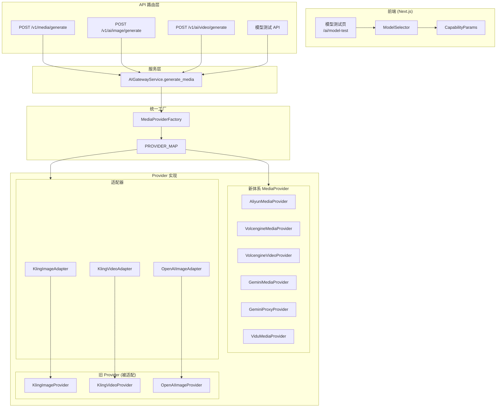
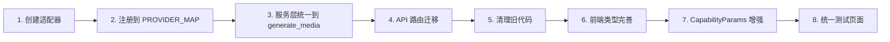
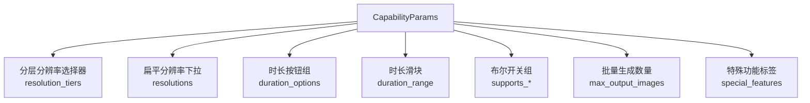

# 设计文档：统一媒体 Provider 体系与模型测试页

## 概述

本设计将系统中并存的两套 Provider 工厂（`ProviderFactory` 和 `MediaProviderFactory`）统一为单一的 `MediaProviderFactory` 体系，通过适配器模式将旧 provider（Kling 图片/视频、OpenAI 图片）桥接到 `MediaProvider` 接口。服务层收敛为 `generate_media()` 单一入口，API 路由同步迁移。前端完善 `ModelCapabilities` 类型定义，增强 `CapabilityParams` 组件以支持分层分辨率、固定时长、布尔开关、动态图片上传、批量生成、特殊功能标签等动态渲染能力。最终构建统一模型测试页面，在同一页面内支持文本/图片/视频三种 AI 能力的测试与结果查看。

### 设计决策

1. **适配器模式而非重写**：Kling 和 OpenAI 的旧 provider 已经稳定运行，采用 Adapter 包装而非重写，降低风险。
2. **渐进式迁移**：先注册适配器到 `PROVIDER_MAP`，再切换服务层入口，最后清理旧代码，每步可独立验证。
3. **前端能力驱动渲染**：`CapabilityParams` 完全由后端 `model_capabilities` JSONB 数据驱动，新增模型无需修改前端代码。
4. **测试页面独立路由**：将模型测试从 settings 页面的 drawer 中提取为独立页面 `/ai/model-test`，提供更好的空间和交互体验。

## 架构

### 整体架构图



### 迁移流程



## 组件与接口

### 后端组件

#### 1. 适配器层 (`providers/adapters/`)

```python
# kling_image_adapter.py
class KlingImageAdapter(MediaProvider):
    def __init__(self, api_key: str, base_url: str | None = None):
        self._provider = KlingImageProvider()
        self._api_key = api_key
        self._base_url = base_url

    async def generate(self, request: MediaRequest) -> MediaResponse:
        cfg = ResolvedModelConfig(
            category="image",
            manufacturer="kling",
            model=request.model_key,
            api_key=self._api_key,
            base_url=self._base_url,
        )
        url = await self._provider.generate_image(
            cfg=cfg,
            prompt=request.prompt,
            resolution=request.param_json.get("resolution"),
            image_data_urls=request.param_json.get("image_data_urls"),
        )
        return MediaResponse(url=url, usage_id="", meta={})
```

```python
# kling_video_adapter.py
class KlingVideoAdapter(MediaProvider):
    async def generate(self, request: MediaRequest) -> MediaResponse:
        # 类似模式，委托给 KlingVideoProvider.generate_video()
        ...

# openai_image_adapter.py
class OpenAIImageAdapter(MediaProvider):
    async def generate(self, request: MediaRequest) -> MediaResponse:
        # 委托给 OpenAIImageProvider.generate_image()
        ...
```

#### 2. 统一工厂注册 (`media_factory.py`)

```python
PROVIDER_MAP: dict[str, type[MediaProvider]] = {
    # 图片厂商 - 新体系
    "aliyun": AliyunMediaProvider,
    "volcengine": VolcengineMediaProvider,
    "doubao": VolcengineMediaProvider,
    "gemini": GeminiMediaProvider,
    "google": GeminiMediaProvider,
    "gemini_proxy": GeminiProxyProvider,
    # 图片厂商 - 适配器
    "kling": KlingImageAdapter,      # 新增
    "openai": OpenAIImageAdapter,    # 新增
    # 视频厂商 - 新体系
    "volcengine_video": VolcengineVideoProvider,
    "vidu": ViduMediaProvider,
    # 视频厂商 - 适配器 (kling 视频复用 kling key，通过 category 区分)
    "aliyun": AliyunMediaProvider,   # 已存在，同时支持图片和视频
}
```

> **注意**：`kling` 同时有图片和视频 provider。由于 `PROVIDER_MAP` 是按 manufacturer key 索引的，需要为 kling 视频使用独立 key（如 `kling_video`）或在 `KlingAdapter` 内部根据 `model_key` 判断调用图片还是视频 provider。推荐方案：创建统一的 `KlingMediaAdapter`，内部根据 model_key 前缀或 category 参数路由到对应的旧 provider。

#### 3. 服务层统一 (`service.py`)

迁移后的 `generate_media()` 成为唯一入口：
- `generate_image()` 和 `generate_video()` 标记为 deprecated，内部转发到 `generate_media()`
- 最终移除这两个方法
- `ProviderFactory` 仅保留 `_text` 字典和 `get_text_provider()`

#### 4. API 路由迁移

| 路由 | 迁移前 | 迁移后 |
|------|--------|--------|
| `POST /v1/ai/image/generate` | `service.generate_image()` | `service.generate_media(category="image")` |
| `POST /v1/ai/video/generate` | `service.generate_video()` | `service.generate_media(category="video")` |
| `POST /v1/media/generate` | `service.generate_media()` | 不变 |
| 模型测试图片 | `service.generate_image()` | `service.generate_media(category="image")` |
| 模型测试视频 | `service.generate_video()` | `service.generate_media(category="video")` |

### 前端组件

#### 1. ModelCapabilities 类型扩展 (`types.ts`)

```typescript
export interface ModelCapabilities {
  // 已有字段
  resolutions?: string[];
  aspect_ratios?: string[];
  duration_range?: { min: number; max: number };
  input_modes?: string[];
  supports_negative_prompt?: boolean;
  supports_reference_image?: boolean;
  // 新增字段
  resolution_tiers?: Record<string, string[]>;
  duration_options?: number[];
  pixel_range?: { min: number; max: number };
  aspect_ratio_range?: { min: number; max: number };
  max_output_images?: number;
  supports_prompt_extend?: boolean;
  supports_watermark?: boolean;
  supports_seed?: boolean;
  max_reference_images?: number;
  special_features?: string[];
  [key: string]: any;
}
```

#### 2. CapabilityParams 增强



渲染优先级规则：
- 分辨率：`resolution_tiers` > `resolutions`（两者互斥渲染）
- 时长：`duration_options` > `duration_range`（两者互斥渲染）
- 布尔开关：仅当对应 `supports_*` 为 `true` 时渲染
- 批量生成：仅当 `max_output_images > 1` 时渲染
- 特殊功能：仅当 `special_features` 非空时渲染

#### 3. 动态参考图片上传

根据 `input_mode` 动态调整上传区域：

| input_mode | 上传区域 | 数量限制 |
|------------|----------|----------|
| `text_to_video` | 隐藏 | 0 |
| `first_frame` | 单张上传，标签"首帧图片" | 1 |
| `first_last_frame` | 两个上传区，标签"首帧图片"+"尾帧图片" | 2 |
| `reference_to_video` | 多图上传 | `max_reference_images` |

#### 4. 统一模型测试页面 (`/ai/model-test`)

```mermaid
graph TB
    subgraph TestPage["模型测试页"]
        Tabs[类别 Tab: 文本 | 图片 | 视频]
        Sidebar[侧边栏: 测试历史]
        
        subgraph TextPanel["文本面板"]
            TC[聊天对话界面]
            TS[流式输出 SSE]
            TB[停止生成/清空对话]
        end
        
        subgraph ImagePanel["图片面板"]
            IMS[ModelSelector + CapabilityParams]
            IP[图片预览区]
            IM[元信息: usage_id, 积分, 耗时]
        end
        
        subgraph VideoPanel["视频面板"]
            VMS[ModelSelector + CapabilityParams]
            VSI[任务状态指示器]
            VPL[视频播放器]
            VM[元信息: 时长, 分辨率, usage_id]
        end
    end
    
    Tabs --> TextPanel
    Tabs --> ImagePanel
    Tabs --> VideoPanel
```


## 数据模型

### 后端数据模型

#### MediaRequest（已有，无需修改）

```python
class MediaRequest(BaseModel):
    model_key: str          # 模型唯一标识，如 "volcengine-v2"
    prompt: str             # 生成提示词
    negative_prompt: str?   # 反向提示词
    param_json: dict        # 动态参数（resolution, duration, aspect_ratio, seed 等）
    callback_url: str?      # 异步回调 URL
```

#### MediaResponse（已有，无需修改）

```python
class MediaResponse(BaseModel):
    url: str                # 生成结果 URL
    duration: float?        # 视频时长（秒）
    cost: float?            # 积分消耗
    usage_id: str           # 审计日志 ID
    meta: dict              # 原始元数据
```

#### ResolvedModelConfig（已有，适配器内部使用）

```python
@dataclass(frozen=True, slots=True)
class ResolvedModelConfig:
    category: str           # "text" | "image" | "video"
    manufacturer: str       # 厂商代码
    model: str              # 模型代码
    api_key: str            # API 密钥
    base_url: str | None    # 基础 URL
```

#### AIModel.model_capabilities JSONB 结构（已有，参考 init_ai_catalog.py）

```json
{
  "resolutions": ["1664x928", "1472x1104"],
  "resolution_tiers": {"480P": ["854x480"], "720P": ["1280x720"]},
  "aspect_ratios": ["16:9", "4:3", "1:1"],
  "aspect_ratio_range": {"min": 0.25, "max": 4.0},
  "pixel_range": {"min": 1638400, "max": 2073600},
  "duration_range": {"min": 2, "max": 15},
  "duration_options": [5, 10],
  "input_modes": ["first_frame", "first_last_frame", "reference_to_video"],
  "max_output_images": 4,
  "max_reference_images": 14,
  "supports_negative_prompt": true,
  "supports_prompt_extend": true,
  "supports_watermark": true,
  "supports_seed": true,
  "supports_reference_image": true,
  "special_features": ["text_rendering", "multi_subject_consistency"],
  "api_endpoint": "text2image/image-synthesis"
}
```

### 前端数据模型

#### ModelCapabilities 接口（扩展后）

```typescript
export interface ModelCapabilities {
  resolutions?: string[];
  resolution_tiers?: Record<string, string[]>;
  aspect_ratios?: string[];
  aspect_ratio_range?: { min: number; max: number };
  pixel_range?: { min: number; max: number };
  duration_range?: { min: number; max: number };
  duration_options?: number[];
  input_modes?: string[];
  max_output_images?: number;
  max_reference_images?: number;
  supports_negative_prompt?: boolean;
  supports_reference_image?: boolean;
  supports_prompt_extend?: boolean;
  supports_watermark?: boolean;
  supports_seed?: boolean;
  special_features?: string[];
  [key: string]: any;
}
```

#### 测试页面状态模型

```typescript
interface ModelTestState {
  activeCategory: "text" | "image" | "video";
  selectedModelConfigId: string;
  sessionId: string;
  sessions: TestSession[];
  // 文本
  messages: ChatMessage[];
  isStreaming: boolean;
  // 图片
  imageResult: ImageResult | null;
  imageRuns: ImageRun[];
  // 视频
  videoTaskStatus: "submitting" | "queued" | "generating" | "completed" | "failed";
  videoElapsedTime: number;
  videoResult: VideoResult | null;
  videoRuns: VideoRun[];
}
```


## 正确性属性 (Correctness Properties)

*属性是在系统所有有效执行中都应成立的特征或行为——本质上是关于系统应该做什么的形式化陈述。属性是人类可读规范与机器可验证正确性保证之间的桥梁。*

### Property 1: 已注册厂商返回有效 Provider 实例

*For any* manufacturer key that exists in `MediaProviderFactory.PROVIDER_MAP`, calling `get_provider(manufacturer, api_key)` should return an instance of `MediaProvider` (not raise an exception).

**Validates: Requirements 1.3**

### Property 2: 未注册厂商抛出 AppError

*For any* string that is not a key in `MediaProviderFactory.PROVIDER_MAP`, calling `get_provider(manufacturer, api_key)` should raise an `AppError` with `code=400` and the error message should contain the manufacturer string.

**Validates: Requirements 1.4**

### Property 3: 适配器字段映射与响应封装

*For any* `MediaRequest` with arbitrary `model_key`, `prompt`, and `param_json` fields, when passed to any adapter (`KlingImageAdapter`, `KlingVideoAdapter`, `OpenAIImageAdapter`), the adapter should correctly extract `param_json` fields (resolution, duration, aspect_ratio, image_data_urls) and map them to the old provider's parameter format, and the returned value should be a valid `MediaResponse` with a non-empty `url` field.

**Validates: Requirements 2.1, 2.2, 2.3, 2.4, 2.5**

### Property 4: API 向后兼容性

*For any* valid image or video generation request in the existing API format (prompt, resolution/aspect_ratio, negative_prompt), the migrated API routes should accept the request and return a response in the same format as before migration.

**Validates: Requirements 4.3**

### Property 5: 分层分辨率联动选择

*For any* `model_capabilities` containing `resolution_tiers` (a mapping of tier names to resolution arrays), when a tier is selected, the CapabilityParams component should display exactly the resolutions belonging to that tier in the second-level dropdown.

**Validates: Requirements 6.2**

### Property 6: 档位切换默认选中首项

*For any* `resolution_tiers` data and any tier switch, the selected resolution should automatically reset to the first resolution in the new tier's array.

**Validates: Requirements 6.5**

### Property 7: 分层分辨率存在时渲染两级选择器

*For any* `model_capabilities` containing a non-empty `resolution_tiers` field, the CapabilityParams component should render a two-level cascading selector (tier selector + resolution selector).

**Validates: Requirements 6.1**

### Property 8: 时长控件渲染优先级

*For any* `model_capabilities`, if `duration_options` is present and non-empty, a button group should be rendered (not a slider); if only `duration_range` is present, a slider should be rendered; if neither is present, no duration control should be rendered.

**Validates: Requirements 7.1, 7.2, 7.3, 7.4**

### Property 9: 布尔能力开关渲染

*For any* `model_capabilities` and any boolean capability field (`supports_prompt_extend`, `supports_watermark`, `supports_seed`), if the field value is `true`, the corresponding UI control (switch or number input) should be rendered; if `false` or absent, it should not be rendered.

**Validates: Requirements 8.1, 8.2, 8.3**

### Property 10: 参数变更回调

*For any* parameter change in CapabilityParams (resolution, duration, toggle, seed value, batch count), the `onParamsChange` callback should be invoked with an object containing the updated parameter key-value pair.

**Validates: Requirements 8.4**

### Property 11: 参考图片上传数量限制

*For any* `input_mode` set to `reference_to_video` and any `max_reference_images` value N, the upload area should accept at most N images, and the hint text should contain the number N.

**Validates: Requirements 9.3, 9.5**

### Property 12: 输入模式切换清空图片状态

*For any* input mode switch (from any mode to any other mode), all previously uploaded images should be cleared.

**Validates: Requirements 9.6**

### Property 13: 批量生成数量输入范围

*For any* `max_output_images` value N (where N > 1), the batch count input should clamp values to the range [1, N], rejecting values outside this range.

**Validates: Requirements 10.1, 10.2**

### Property 14: 特殊功能标签展示

*For any* non-empty `special_features` array, each feature string in the array should be rendered as a Badge element in the CapabilityParams component.

**Validates: Requirements 11.1**

### Property 15: 类别切换加载对应模型

*For any* category tab switch (text/image/video), the model test page should load and display only the model configurations belonging to that category.

**Validates: Requirements 12.2**

### Property 16: 生成结果元信息展示

*For any* successful media generation response (image or video), the test page should display the meta information including usage_id, credits cost, and generation time (for images) or duration and resolution (for videos).

**Validates: Requirements 13.3, 14.4**

### Property 17: 生成失败错误展示

*For any* failed media generation response (image or video), the test page should display an error message containing the error code and error description.

**Validates: Requirements 13.4, 14.5**

### Property 18: 生成历史累积

*For any* new generation result (image or video) in the current session, the result should be appended to the history list, and the list length should increase by one.

**Validates: Requirements 13.5, 14.6**

### Property 19: 视频任务状态流转

*For any* video generation task, the status indicator should transition through the defined states (submitting → queued → generating → completed/failed), and each state should be visually distinguishable.

**Validates: Requirements 14.1**

### Property 20: 流式文本增量显示

*For any* sequence of SSE delta events, the displayed assistant message content should grow monotonically — each new delta should be appended to the existing content without losing previous content.

**Validates: Requirements 15.1**

### Property 21: 多轮对话上下文保持

*For any* sequence of user messages sent in the same session, the message history sent to the backend should contain all previous messages in order, maintaining conversation context.

**Validates: Requirements 15.2**

### Property 22: 会话历史信息展示

*For any* test session in the history sidebar, the displayed entry should contain both the creation time and the run count.

**Validates: Requirements 16.3**

### Property 23: 会话加载完整内容

*For any* historical session that is clicked, the test page should load and display the complete content of that session (text messages / image results / video results depending on category).

**Validates: Requirements 16.2**

## 错误处理

### 后端错误处理

| 错误场景 | 处理方式 | HTTP 状态码 |
|----------|----------|-------------|
| 未注册的 manufacturer | `AppError(code=400)` 包含厂商名称 | 400 |
| 适配器内旧 provider 异常 | 捕获并转换为 `AppError(code=502)` | 502 |
| API 密钥无效 | 上游返回 401/403，转换为 `AppError(code=502)` | 502 |
| 生成超时 | 轮询超时，转换为 `AppError(code=504)` | 504 |
| 积分不足 | `AppError(code=403)` | 403 |
| 生成失败时积分退还 | 自动退还已扣积分，记录 refund 事件 | - |

### 前端错误处理

| 错误场景 | 处理方式 |
|----------|----------|
| 模型列表加载失败 | 显示错误提示，提供重试按钮 |
| 图片/视频生成失败 | 在预览区显示错误信息（错误码 + 描述） |
| SSE 流中断 | 显示已接收内容 + 错误提示 |
| 图片上传超限 | Toast 提示"最多 N 张" |
| 会话加载失败 | 显示错误提示，保持当前状态 |
| 网络断开 | 全局错误提示，自动重试机制 |

## 测试策略

### 双重测试方法

本特性采用单元测试与属性测试相结合的方式：

- **单元测试**：验证具体示例、边界情况和错误条件
- **属性测试**：验证跨所有输入的通用属性

两者互补，单元测试捕获具体 bug，属性测试验证通用正确性。

### 后端测试

#### 属性测试（Property-Based Testing）

使用 **Hypothesis** 库（Python PBT 标准库），每个属性测试至少运行 100 次迭代。

每个测试必须以注释标注对应的设计属性：
```python
# Feature: unified-media-provider, Property 1: 已注册厂商返回有效 Provider 实例
# Feature: unified-media-provider, Property 2: 未注册厂商抛出 AppError
# Feature: unified-media-provider, Property 3: 适配器字段映射与响应封装
# Feature: unified-media-provider, Property 4: API 向后兼容性
```

每个正确性属性必须由单个属性测试实现。

#### 单元测试

- 适配器委托调用验证（mock 旧 provider，验证参数传递）
- `PROVIDER_MAP` 包含所有预期厂商 key（需求 1.1, 1.2）
- 服务层 `generate_media()` 对 image/video 类别的路由（需求 3.1, 3.2）
- API 路由迁移后的请求/响应格式（需求 4.1, 4.2）
- 边界情况：空 manufacturer、大小写不敏感、前后空格处理

### 前端测试

#### 属性测试（Property-Based Testing）

使用 **fast-check** 库（TypeScript/JavaScript PBT 库），每个属性测试至少运行 100 次迭代。

每个测试必须以注释标注对应的设计属性：
```typescript
// Feature: unified-media-provider, Property 5: 分层分辨率联动选择
// Feature: unified-media-provider, Property 8: 时长控件渲染优先级
// Feature: unified-media-provider, Property 9: 布尔能力开关渲染
// ...
```

每个正确性属性必须由单个属性测试实现。

#### 单元测试

- CapabilityParams 渲染：各种 model_capabilities 组合的渲染结果
- ModelSelector 输入模式切换：各模式下的上传区域渲染（需求 9.1, 9.2, 9.4）
- 测试页面 Tab 切换：各类别面板的渲染（需求 12.3, 12.4, 12.5）
- 图片/视频结果展示：成功和失败状态的 UI（需求 13.1, 13.2, 14.2, 14.3）
- 文本对话：清空对话、停止生成按钮（需求 15.3, 15.4, 15.5）
- 测试历史：会话列表、新建会话（需求 16.1, 16.4）
- 边界情况：空 capabilities、缺失字段、极端值

### 测试覆盖矩阵

| 需求 | 单元测试 | 属性测试 |
|------|----------|----------|
| 1. Provider 注册 | ✓ (1.1, 1.2) | ✓ (Property 1, 2) |
| 2. 适配器迁移 | ✓ (mock 验证) | ✓ (Property 3) |
| 3. 服务层统一 | ✓ (3.1, 3.2) | - |
| 4. API 路由迁移 | ✓ (4.1, 4.2) | ✓ (Property 4) |
| 5. 类型定义 | TypeScript 编译器 | - |
| 6. 分层分辨率 | ✓ (6.3, 6.4) | ✓ (Property 5, 6, 7) |
| 7. 时长选项 | ✓ (7.3, 7.4) | ✓ (Property 8) |
| 8. 布尔开关 | - | ✓ (Property 9, 10) |
| 9. 动态图片上传 | ✓ (9.1, 9.2, 9.4) | ✓ (Property 11, 12) |
| 10. 批量生成 | ✓ (10.3) | ✓ (Property 13) |
| 11. 特殊功能标签 | ✓ (11.2) | ✓ (Property 14) |
| 12. 测试页面 | ✓ (12.1, 12.3-12.5) | ✓ (Property 15) |
| 13. 图片结果 | ✓ (13.1, 13.2) | ✓ (Property 16, 17, 18) |
| 14. 视频进度 | ✓ (14.2, 14.3) | ✓ (Property 16, 17, 18, 19) |
| 15. 文本对话 | ✓ (15.3, 15.4, 15.5) | ✓ (Property 20, 21) |
| 16. 测试历史 | ✓ (16.1, 16.4) | ✓ (Property 22, 23) |
